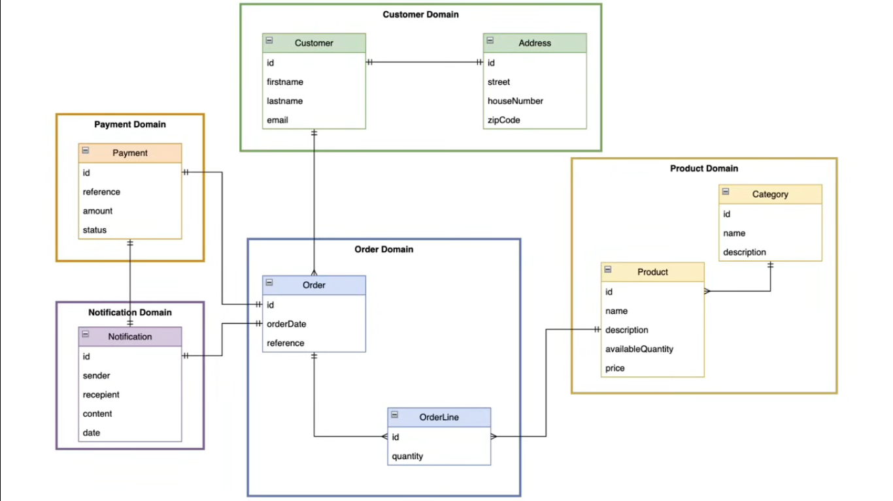

# Easy-Buy

Easy-Buy is a **Spring Boot microservices backend** for an e-commerce workflow (customers, catalog, orders, payments, and notifications), designed with cloud-native patterns and production-style infrastructure.

## Why this project stands out

- **Microservices architecture** with clear domain boundaries
- **API Gateway + Service Discovery** for scalable routing
- **Centralized configuration** using Spring Cloud Config Server
- **Event-driven communication** with Apache Kafka
- **Polyglot persistence** (PostgreSQL + MongoDB)
- **Observability-ready** with Zipkin tracing and Spring Actuator
- **Security integration** via Keycloak (OAuth2 resource server)

## Architecture


## Data model



## Services

| Service | Responsibility | Default Port |
|---|---|---|
| Config Server | Centralized configuration for all services | 8888 |
| Discovery Service | Eureka service registry | 8761 |
| Gateway Service | API gateway and auth entry point | 8222 |
| Customer Service | Customer CRUD and lookup | 8090 |
| Product Service | Product catalog and stock purchase flow | 8050 |
| Order Service | Order creation and retrieval | 8070 |
| Payment Service | Payment processing | 8060 |
| Notification Service | Email and Kafka-driven notifications | 8040 |

## Core APIs (via Gateway)

- `/api/v1/customers/**`
- `/api/v1/products/**`
- `/api/v1/orders/**`
- `/api/v1/order-lines/**`
- `/api/v1/payments/**`

## Tech stack

- **Java 17**
- **Spring Boot 3**
- **Spring Cloud** (Gateway, Eureka, Config Server, OpenFeign)
- **PostgreSQL**, **MongoDB**
- **Apache Kafka**
- **Keycloak**
- **Zipkin**, **Spring Actuator**
- **Docker Compose**

## Getting started

### 1) Start infrastructure dependencies

```bash
docker compose up -d
```

### 2) Start services

Start each service from its folder in this order:

1. `services/config-server`
2. `services/discovery`
3. `services/gateway`
4. `services/customer`
5. `services/product`
6. `services/payment`
7. `services/order`
8. `services/notification`

Run each one with:

```bash
./mvnw spring-boot:run
```

## Repository structure

```text
services/
  config-server/
  discovery/
  gateway/
  customer/
  product/
  order/
  payment/
  notification/
digrarams/
docker-compose.yml
```